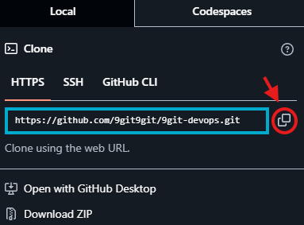
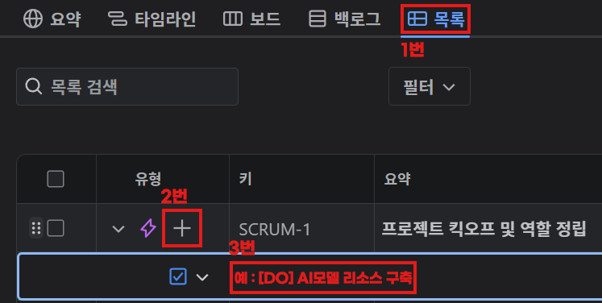
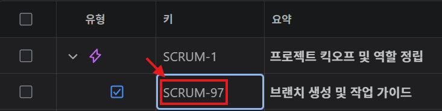
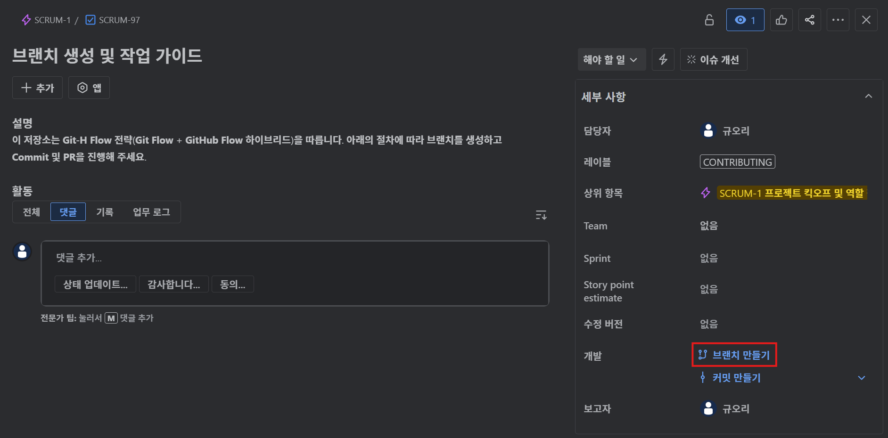
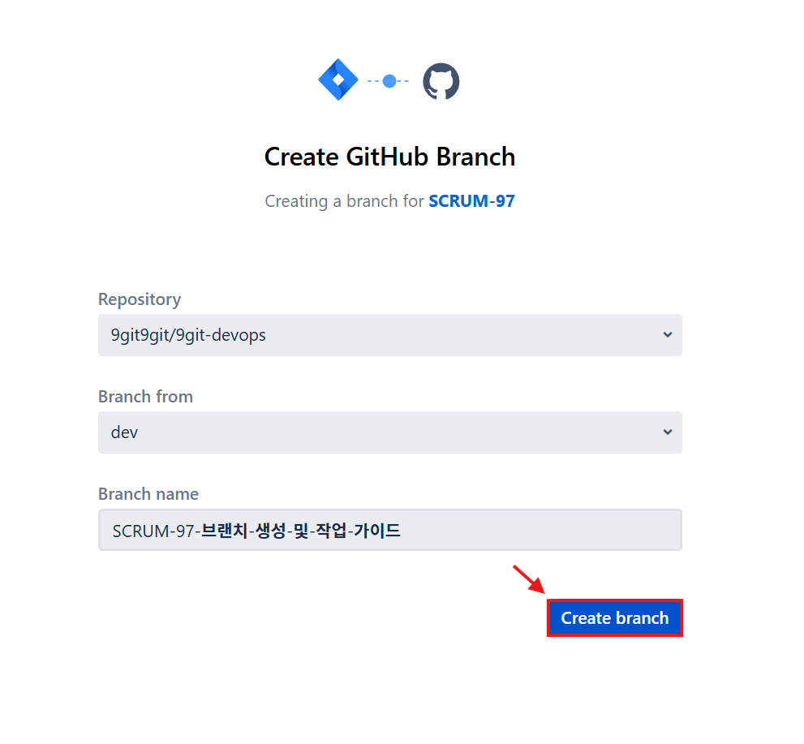
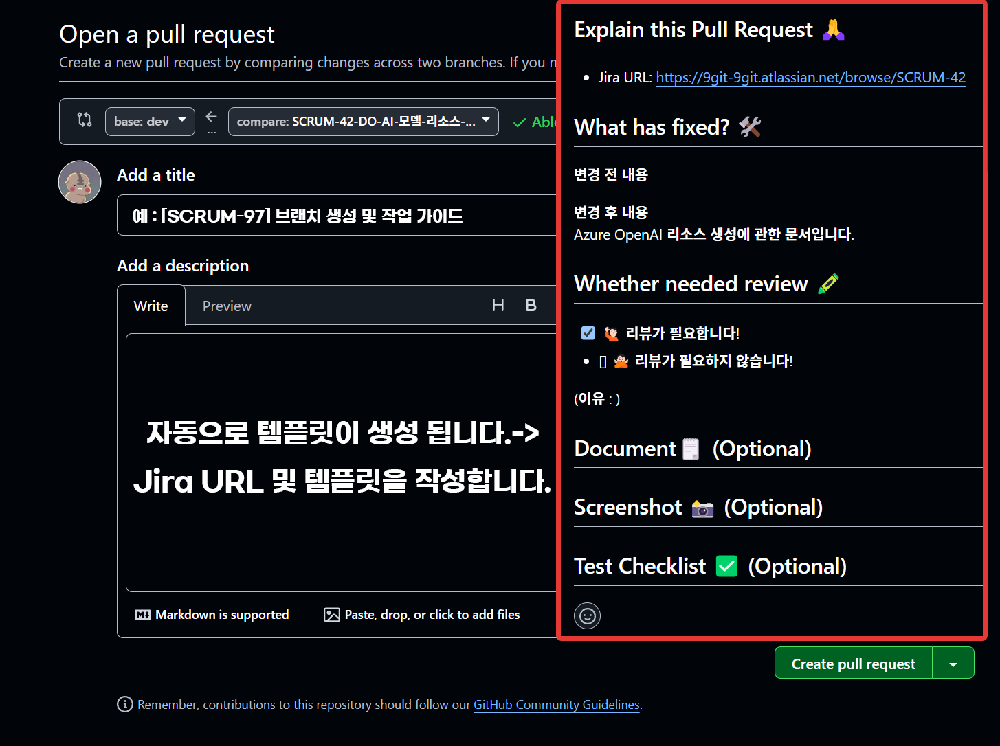

# CONTRIBUTING.md

# 🔹 브랜치 생성 및 작업 가이드

이 저장소는 `Git-H Flow` 전략(`Git Flow` + `GitHub Flow` 하이브리드)을 따릅니다. 
아래의 절차에 따라 브랜치를 생성하고 `Commit` 및 `PR`을 진행해 주세요.

---

## 1️⃣ 저장소 클론(`Clone`)

> `GitHub`의 저장소를 내 컴퓨터에 복제하여 `VSCode`에서 작업할 수 있도록 하는 과정입니다.
 

---

1. 포크한 저장소에서 `<> Code ▼` 초록색 버튼을 클릭합니다.
2. `HTTPS URL`을 복사합니다. (예: `https://github.com/your-username/project-name.git`)
    
{: .align-center}
    
3. `VSCode`를 실행하고, 터미널(`Ctrl + ~`)을 엽니다.
4. 터미널에서 아래 명령어를 입력합니다.

```powershell
git clone https://github.com/your-username/project-name.git
```

1. `Clone`된 폴더로 이동합니다.

```powershell
cd project-name
```

> `cd`는 change directory의 약자입니다.
방금 `Clone`한 폴더(`project-name`)로 이동하여 그 안에서 작업을 시작하기 위해 사용합니다.
 
1. `Visual Studio Code`로 프로젝트 폴더를 엽니다.

```powershell
code .
```

> 현재 디렉토리를 `VS Code`에서 바로 열어 개발을 시작할 수 있게 해주는 명령어입니다.

만약 수동으로 열고 싶다면, `VS Code`에서 '파일 ➡️ 폴더 열기' 를 눌러 클론한 폴더를 선택해주세요.

---

## 2️⃣  `dev` 브랜치 생성 및 최신화

> 협업은 `dev` 브랜치를 기준으로 진행되며,
항상 최신 상태를 유지한 뒤 작업 브랜치를 따로 생성해야 합니다.
 

---

1. `dev` 브랜치로 이동합니다.

```powershell
git checkout dev
```

> `checkout`는 브랜치를 해당 브랜치로 전환하는 명령어입니다.
 
 
> 브랜치 이름은 반드시 소문자 `dev`로 통일합니다.
 

---

2. 원격 저장소에서 최신 브랜치 목록을 불러옵니다.

```powershell
git fetch origin
```

> fetch는 GitHub의 원격 저장소(origin)로부터 브랜치 목록과 최신 커밋 이력을 가져오는 명령어입니다.

 
> 단, 이 단계에서는 로컬 코드에 직접 반영되지 않습니다.

> 이후 `rebase`나 `merge`를 통해 적용하게 됩니다.


---

3. 로컬 `dev` 브랜치를 원격 `origin/dev` 기준으로 정렬합니다.

```powershell
git rebase origin/dev
```

> `rebase`는 현재 브랜치(`dev`)의 기반을 원격 저장소의 최신 커밋 이력으로 재정렬합니다.
팀 협업 시 `merge`보다 `rebase`를 사용하면 브랜치 기록이 직선 형태로 정리되어 보기 쉽고 충돌 관리도 편리합니다.
 

항상 `fetch` 이후 `rebase`를 순서대로 실행해야 안정적으로 동기화됩니다.

---

## 3️⃣ `Jira` 이슈 기반 브랜치 만들기

> 모든 작업은 `Jira`에서 발급된 이슈(변경 불가)를 기준으로 브랜치를 생성합니다.
 
 
> 브랜치 이름은 이슈 키와 작업 내용을 조합하여 자동 생성(변경 가능)합니다.


---

1. `Jira`에 상위 카테고리에서  1번`목록`을 클릭합니다.
2.  에픽(⚡) 옆 2번 ➕ 버튼을 하위 이슈를 생성합니다.
3. 3번에 `[소속 팀] 이슈 제목` 을 작성해주고 `Enter` 를 눌러줍니다.
    
{: .align-center}
    
4. 만들어진 이슈 옆에 이슈 키(예: `SCRUM-97`)를 클릭합니다. 
    
{: .align-center}
    
5. 세부사항 창으로 이동하게 됩니다 :
    - `레이블` 옆에 `없음` 부분을 클릭하고, 팀/기능/역할 순으로 입력합니다.
       (예: `fe`, `login`, `markup`)
    - `Team` 옆에 `없음` 부분을 클릭하고, 소속 팀을 선택합니다.
       (예: `FE`, `BE`, `AI`, `DO`)
6. 이슈 상세 페이지 우측 하단의 `브랜치 만들기`를 클릭합니다.
    
{: .align-center}
    
7. `Create GitHub branch` 창이 열리면 :
    - `Repository` : 팀 저장소 선택
    - `Branch from` : `dev` 선택
    - `Branch name` : 자동 지정된 이름 복사 (예: `SCRUM-97-브랜치-생성-및-작업-가이드`)
    - `Create branch` 클릭
        
{: .align-center}
        

---

## 4️⃣ 복사한 브랜치 네임으로 로컬 브랜치 생성 및 설정

> `Jira`에서 생성된 브랜치 이름을 기준으로, 
로컬 환경에서도 동일한 브랜치를 만들고 원격 상태와 동기화합니다.
 

---

1. `VSCode` 로 돌아와서 복사한 브랜치 이름으로 로컬 브랜치를 생성합니다.

```powershell
git checkout -b 복사한 브랜치 이름 (예: SCRUM-97-브랜치-생성-및-작업-가이드)
```

> Jira에서 생성한 브랜치 이름과 정확히 일치해야 원격 브랜치와 연결이 가능합니다.
 

> `checkout -b`는 브랜치를 만들고 해당 브랜치로 즉시 이동하는 명령어입니다.
 

---

1. 원격 저장소의 최신 브랜치 목록을 가져옵니다.

```powershell
git fetch origin
```

> 원격 저장소(origin)의 브랜치 정보와 커밋 내역을 로컬에 가져오는 명령어입니다.
 
 
> 새로운 원격 브랜치 인식에도 필요하므로 반드시 먼저 실행해야 합니다.
 

---

1.  로컬 브랜치를 원격 브랜치 기준으로 정렬합니다.

```bash
git rebase origin/복사한 브랜치 이름 (예: SCRUM-97-브랜치-생성-및-작업-가이드)
```

> 원격 브랜치를 기준으로 로컬 브랜치 커밋을 재배열합니다.
 
 
> 커밋 히스토리를 깔끔하게 유지하기 위해 `merge` 대신 `rebase`를 사용합니다.
 

브랜치 정리가 완료되었으니, 변경 파일을 수정하며 기능 개발을 진행합니다.

---

## 5️⃣ 기능 개발 및 커밋

> 브랜치 설정이 완료되면, 해당 브랜치에서 기능을 개발하고,
`Gitmoji`를 사용해 커밋 제목과 메세지를 작성 후 원격 저장소에 푸시합니다.
 

---

1. 변경된 파일을 스테이징합니다.

```powershell
git add .
```

> 모든 변경 파일을 스테이징 영역에 추가합니다.
 
 
> 필요한 경우 특정 파일만 선택적으로 추가할 수도 있습니다.
 

---

1. 변경 사항을 확인합니다.

```powershell
git status
```

> 수정된 파일, 신규 파일 등 현재 작업 디렉토리 상태를 확인합니다.
 

---

1.  `gitmoji`로 커밋을 생성합니다.

```powershell
gitmoji -c
```

> 이 명령어를 입력하면, 아래 순서로 커밋을 생성할 수 있습니다:
 

3-1. 방향키로 이모지 선택 (예: ✨, 🐛, ♻️ 등)

3-2. 커밋 제목 입력 (예: AI 모델 초기 구축)

3-3. 커밋 메시지 입력 (예: 모델 디렉토리 구성 및 가중치 파일 관리 모듈 추가)

---

1. 작업 브랜치를 원격 저장소로 푸시합니다.

```powershell
git push origin 복사한 브랜치 이름 (예: SCRUM-97-브랜치-생성-및-작업-가이드)
```

4-1. 만약 푸시가 거부된다면, 안전한 강제 푸시인 `--force-with-lease` 옵션을 먼저 시도해보세요.

```powershell
git push --force-with-lease origin 복사한 브랜치 이름
```

그래도 해결되지 않을 경우, 최후의 수단으로 모든 커밋을 강제로 덮어쓰는 `-f` 옵션을 사용합니다.

```powershell
git push -f origin 복사한 브랜치 이름
```

> ⚠️ `-f`는 협업 중인 커밋 기록을 날려버릴 수 있으므로 반드시 주의해서 사용해야 합니다.
 

> 로컬 브랜치의 커밋 내용을 원격 저장소에 업로드합니다.
 
 
> 이후 `GitHub`에서 `Pull Request` 생성을 진행할 수 있습니다.
 

---

## 6️⃣ `GitHub`에서 `Pull Request` 생성

> 로컬에서 작업한 내용을 원격 저장소(`origin`)에 푸시한 후,
 
 
> 해당 브랜치를 기준으로 `PR`를 생성하여 코드 리뷰를 요청합니다.
 

---

1. `GitHub`저장소에 접속합니다.
2. 우측 상단 브랜치 선택 메뉴에서 `main` ➡️ `SCRUM-[number]-[team]-[feature]` 브랜치로 변경합니다.
3. 메인화면에 `Compare & pull request` 버튼을 클릭합니다. 
(뜨지 않는다면 `Pull requests` 탭으로 이동)
4. `base : dev` ⬅️ `compare : SCRUM-[number]-[team]-[feature]` 브랜치로 선택합니다.
5. `PR` 제목은 다음 형식으로 작성합니다 :
    
    ```powershell
    예 : [SCRUM-97] 브랜치 생성 및 작업 가이드
    ```
    
6. `PR` 본문에는 자동으로 템플릿이 생성됩니다. 
`Jira URL` 및 템플릿을 작성합니다.
7. 모든 내용 확인 후 우측 하단의 `Create pull request | ▼ |`를 클릭하여 제출합니다.

{: .align-center}

> 제출한 `Pull Request`는 반드시 리뷰 승인 후 `Merge`해야 하며,
리뷰 전에는 직접 `Merge`하거나 강제 `Push`하지 않습니다.
 

해당 팀의 팀장 혹은 팀원에게 코드 리뷰를 요청합니다.
팀 내 리뷰 기준에 따라 승인(✅)을 받으면,  `Merge` 를 진행합니다.

---