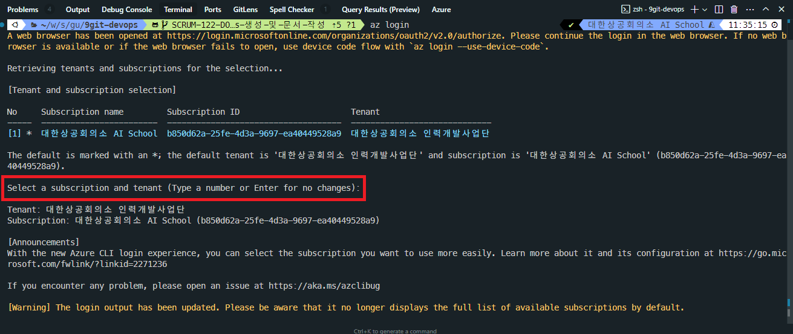
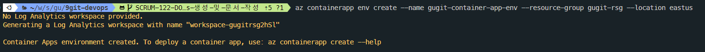
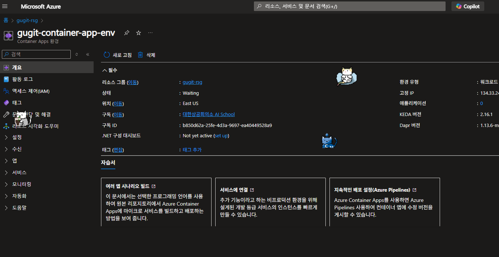
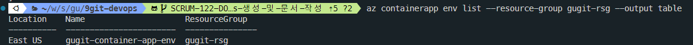

# Azure Container Apps

> `Azure Container Apps`는 컨테이너화된 애플리케이션을 배포하고 관리하기 위한 클라우드 기반 서비스입니다.

## Azure Container Apps 리소스 생성

### CLI 명령어

#### Azure 로그인

```bash
az login
```

- 로그인을 진행하면 web browser 페이지가 열리고 로그인을 진행할 수 있다.
  - 아래 캡처에서 표시된 부분은 Enter로 넘어가자.



#### Azure Container Apps 리소스 생성

```bash
# az containerapp env create --name [container-app-env-name] --resource-group [resource-group-name] --location [location]
az containerapp env create --name gugit-container-app-env --resource-group gugit-rsg --location eastus
```

- 위 명령어를 실행하면 생각보다 오래 걸리는데 아래 캡처와 같이 리소스가 생성된다.



- Azure Portal에서도 확인할 수 있으며, 명령어로도 확인이 가능하다.

```bash
# az containerapp env list --resource-group [resource-group-name]
az containerapp env list --resource-group gugit-rsg
# 간단하게 보려면
az containerapp env list --resource-group gugit-rsg --output table
```




