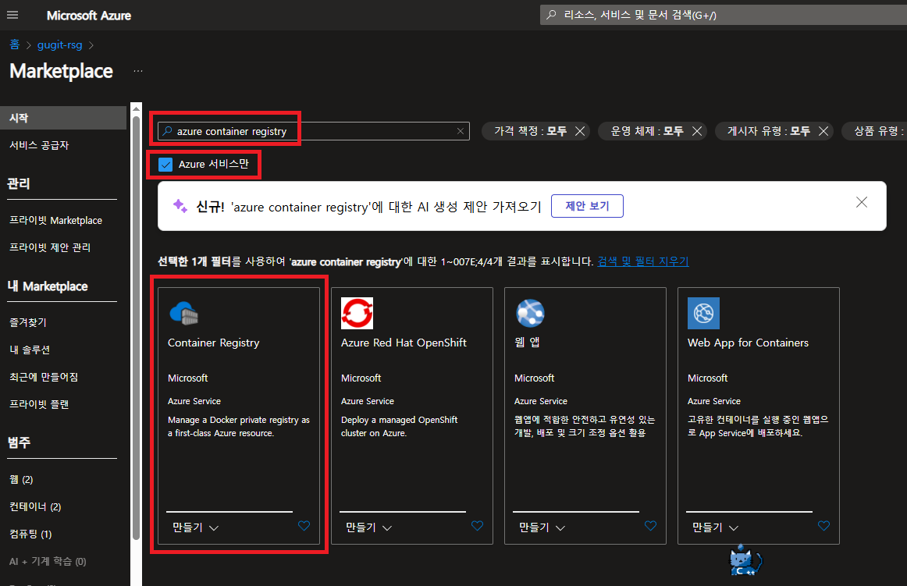
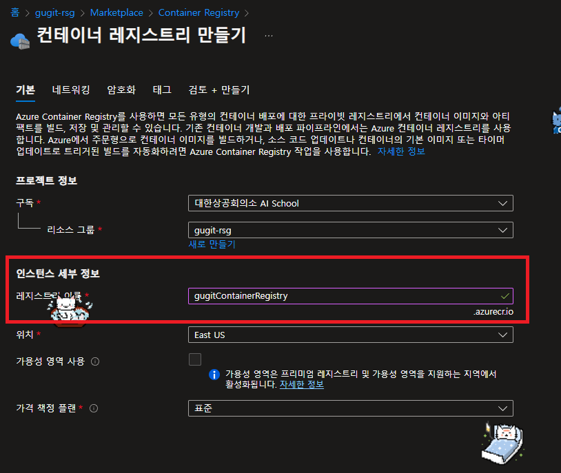
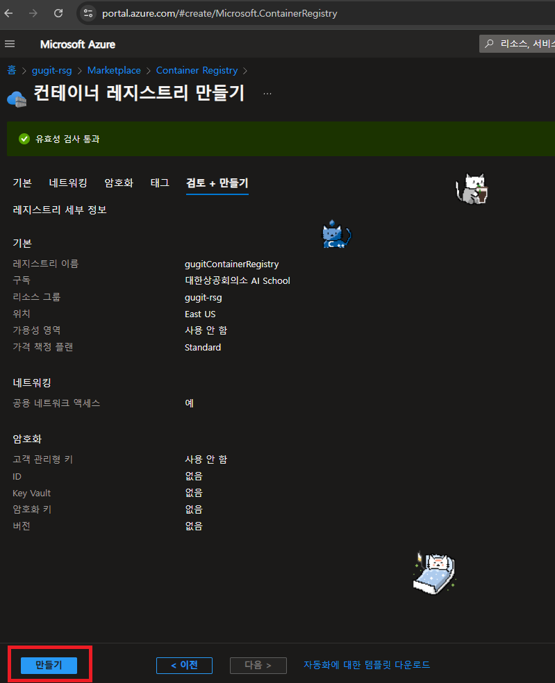

# Azure Container Registry

> `Azure Container Registry`는 컨테이너 이미지를 저장하고 관리하는 데 사용되는 클라우드 기반 서비스입니다.

## Azure Container Registry 선택 이유

Azure Container Registry를 선택하는 이유는 다음과 같습니다:

- **컨테이너 이미지 저장**: 컨테이너 이미지를 저장하고 관리할 수 있습니다.
- **보안**: 데이터 암호화, 네트워크 보안, 사용자 인증 및 권한 관리와 같은 다양한 보안 기능을 제공합니다.

## Azure Container Registry 리소스 생성

- Azure Portal에서 `Azure Container Registry` 리소스를 생성할 수 있습니다.

- 리소스 기본 정보에서는 레지스트리 이름만 작성해주고 나머지는 기본 설정으로 진행하였다.
  - 참고로 레지스트리 이름은 영어와 숫자만 사용할 수 있다.

- 검토 및 만들기를 하면 배포가 된다.

# 참고 자료

- [Azure Container Registry 설명서](https://learn.microsoft.com/ko-kr/azure/container-registry/)
