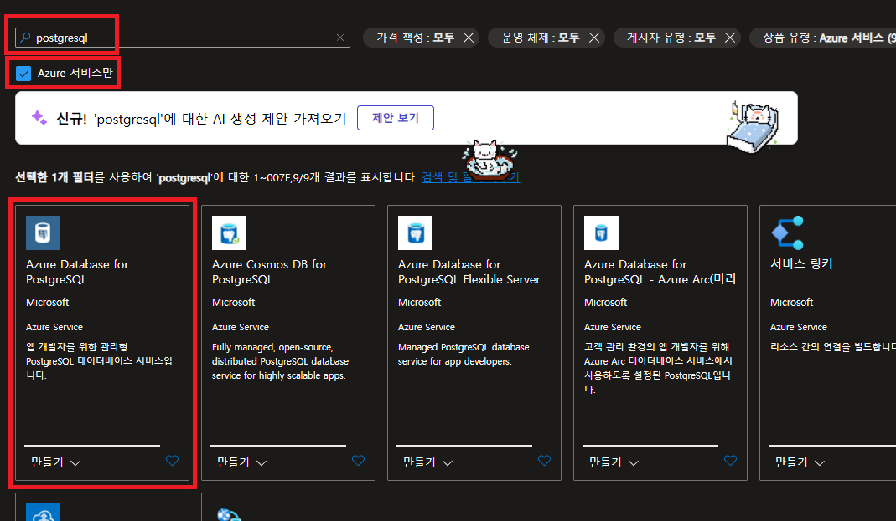
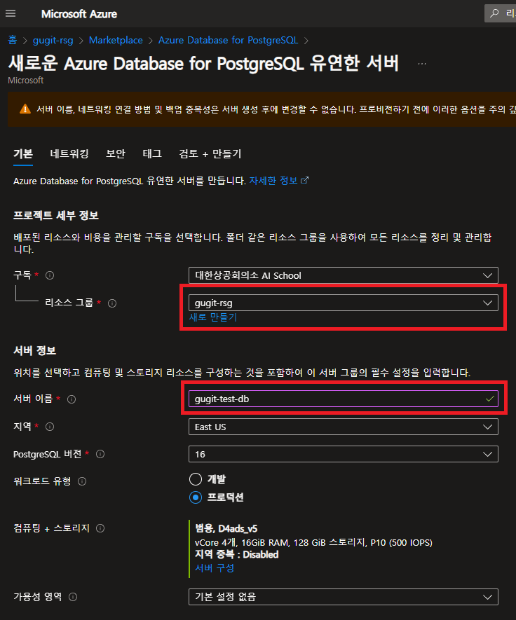
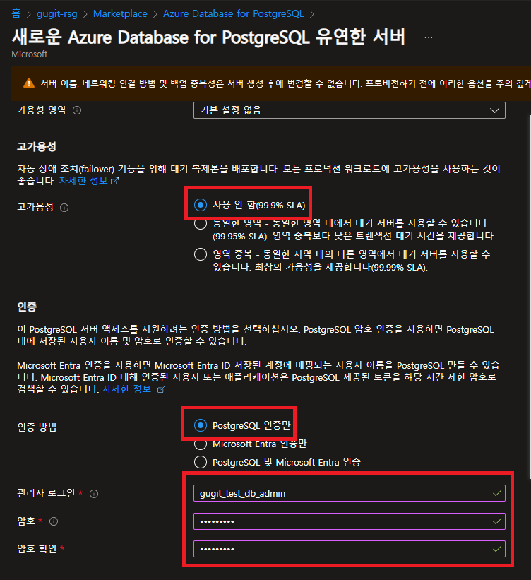
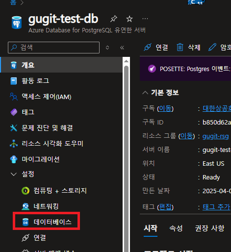
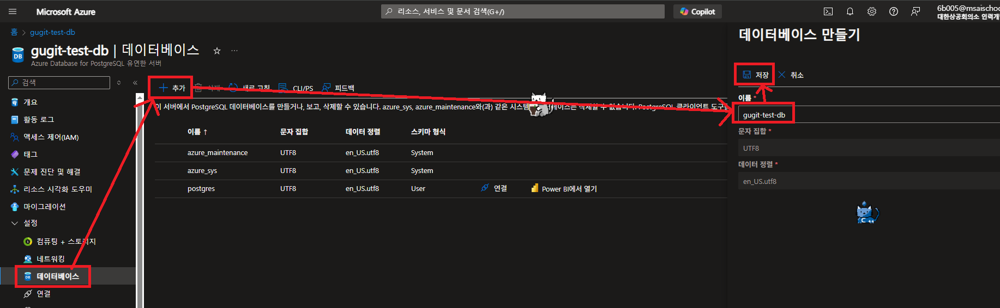

# Azure Database for PostgreSQL

> `Azure Database for PostgreSQL`는 클라우드에서 관계형 데이터베이스를 신속하게 만들고 관리할 수 있는 관리형 데이터베이스 서비스입니다.

# Azure Database for PostgreSQL 리소스 생성

- Azure Portal에서 `Azure Database for PostgreSQL` 리소스를 생성할 수 있습니다.

{: .align-center}

- 리소스 만들기를 클릭하면 리소스 생성 페이지로 이동합니다.
  - 리소스 그룹, 서버 이름, 고가용성, 인증 방법, 관리자 로그인, 암호, 암호 확인을 입력합니다.
  - 이미 환경에 익숙하신 분들은 원하는 환경에 맞게 설정합니다.
- 설정을 다하면 `다음` 버튼을 클릭합니다.

{: .align-center}
{: .align-center}

- 연결 방법은 이후에 바꿀 수 없으므로 `공용 액세스(허용된 IP 주소) 및 프라이빗 엔드포인트` 방법을 선택합니다.
  - 현재 클라이언트 컴퓨터의 IP 주소를 허용하는 것으로 설정합니다.
  - 이후에 엑세스 가능한 IP 주소를 추가할 수 있습니다.
- `검토 + 만들기` 버튼을 클릭합니다.

{: .align-center}

- 배포는 몇 분 정도 걸립니다.

# Azure Database for PostgreSQL 기본 데이터베이스 생성

- 배포가 완료되면 `Azure Database for PostgreSQL` 리소스로 이동합니다.
- 설정 탭에서 `데이터베이스` 탭을 클릭합니다.

{: .align-center}

- `추가` 버튼을 클릭합니다.
- 데이터베이스 이름을 입력하고 `저장` 버튼을 클릭합니다.

{: .align-center}

# 참고 자료

- [Azure Database for PostgreSQL](https://learn.microsoft.com/en-us/azure/postgresql/)