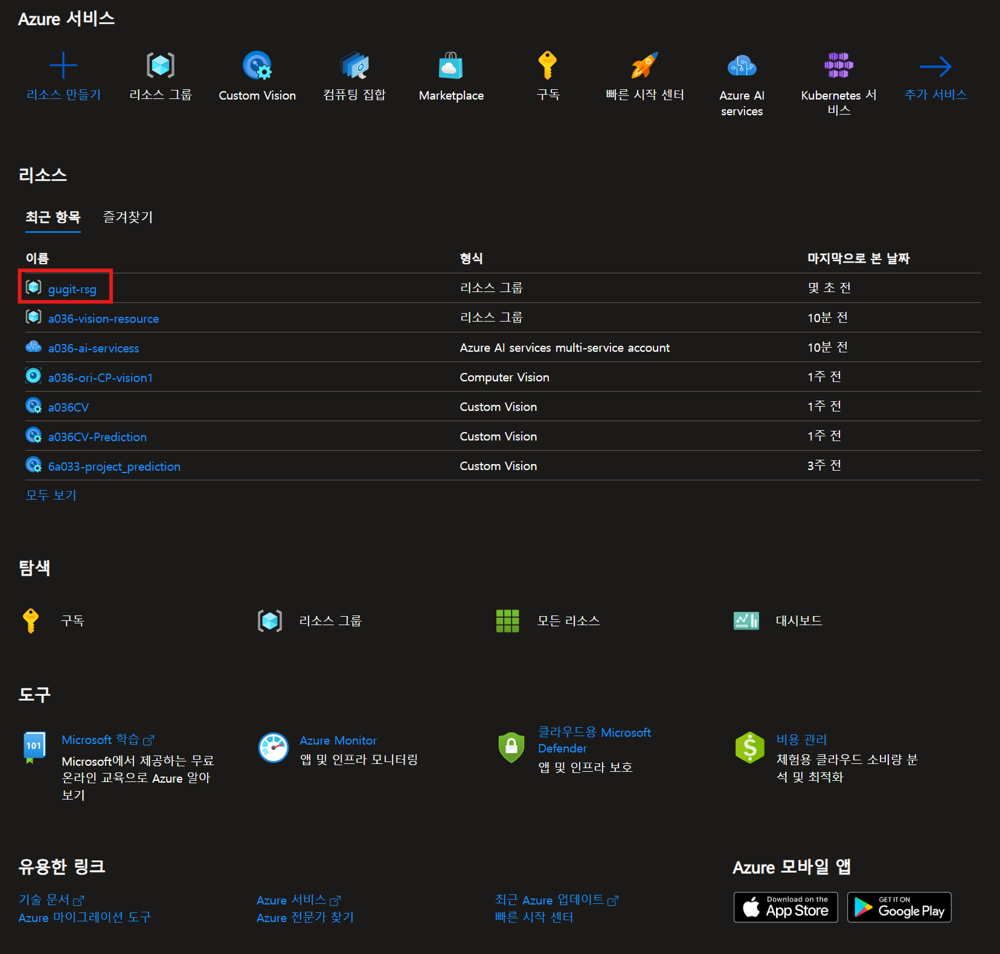
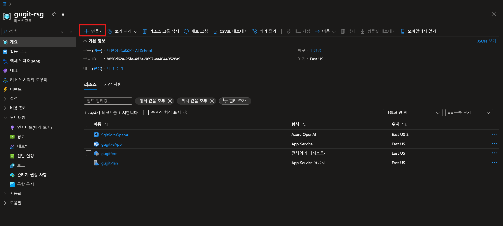
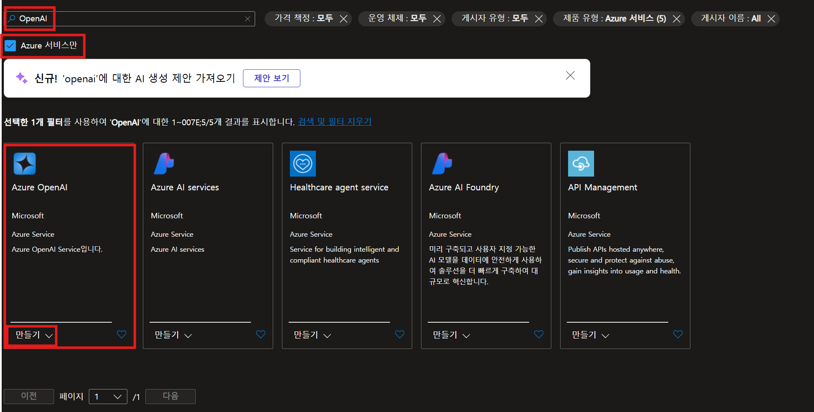
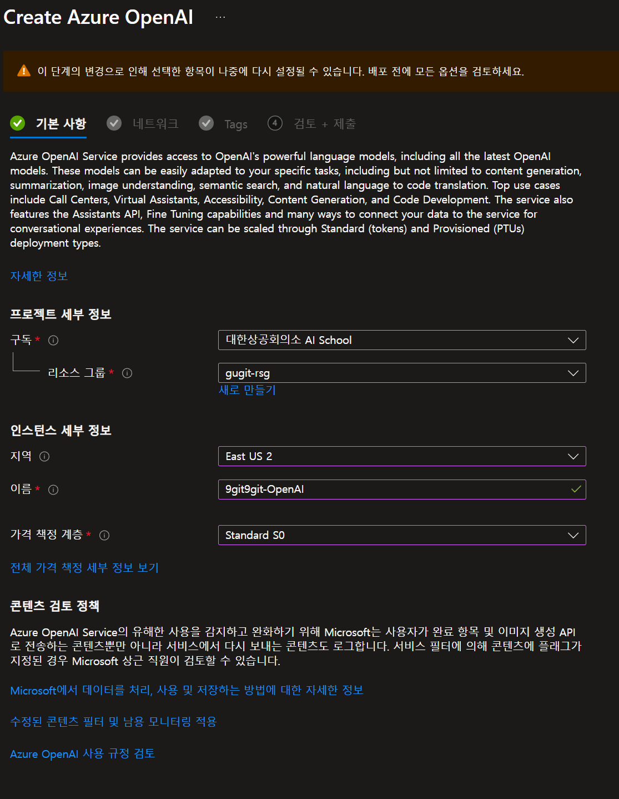
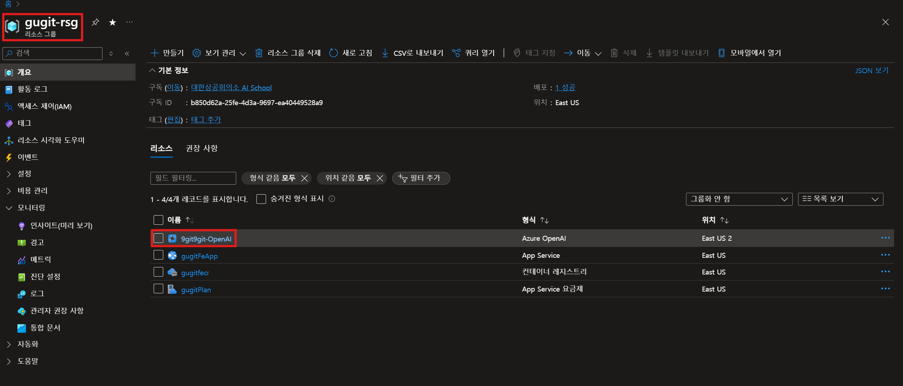
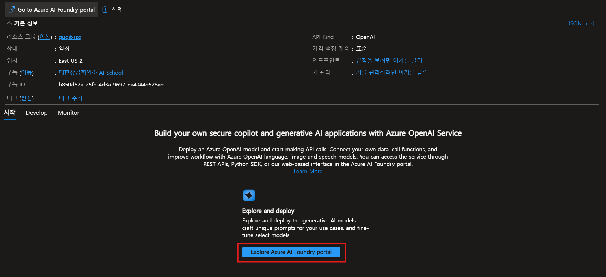

# Azure OpenAI 서비스 만들기

> 미리 만들어 놓은 리소스 그룹을 선택합니다.
> 

{: .align-center}

> 상단에 만들기 버튼을 클릭합니다.
> 

{: .align-center}

1. 검색창에 `OpenAI` 라고 검색 합니다.
2. ☑️Azure 서비스만을 체크 합니다.
3. Azure OpenAI 에 만들기 버튼을 눌러서 생성해줍니다.

{: .align-center}

> 이런 창으로 이동하게 됩니다.
> 
1. 구독에서 대한상공회의소 AI School로 선택해줍니다. (기본 선택 되어있음)
2. 리소스 그룹에는 지정한 프로젝트 리소스 그룹명이 맞는지 확인합니다.  (기본 선택 되어있음)
3. 인스턴스 세부 정보에 지역을 선택합니다. 
4. 이름을 지정해줍니다. 
5. 가격 책정 계층에서 `Standard S0` 을 선택합니다. (선택지가 하나 뿐임)
6. **`다음`→ `다음`→ `다음`**을 눌러 생성 합니다.

❗만약 유효성 검사가 실패했다고 나온다면, Azure에서 OpenAI 리소스를 배포하려 할 때 **할당된 쿼터(Quota)가 부족해서 실패**했다는 뜻입니다. 이때, 당황하지말고 다른지역으로 선택해줍시다.

{: .align-center}

> 다시 리소스그룹으로 돌아와서 방금 만든 Open AI 서비스를 클릭합니다.
> 

{: .align-center}

> 클릭해서 실행해 줍니다.
> 

{: .align-center}