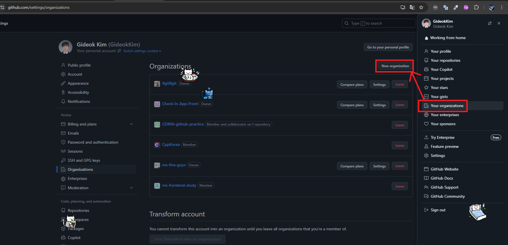
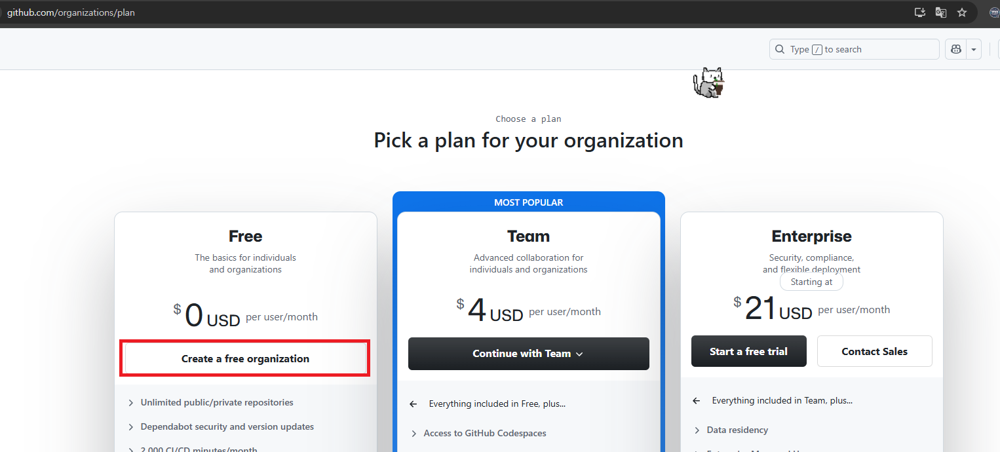
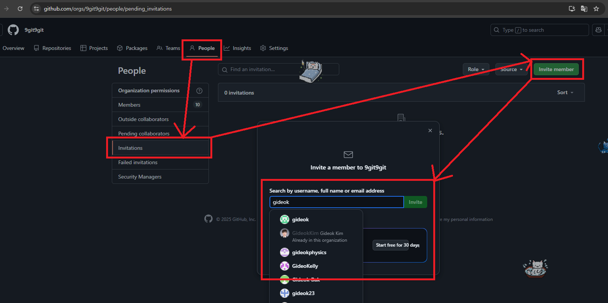
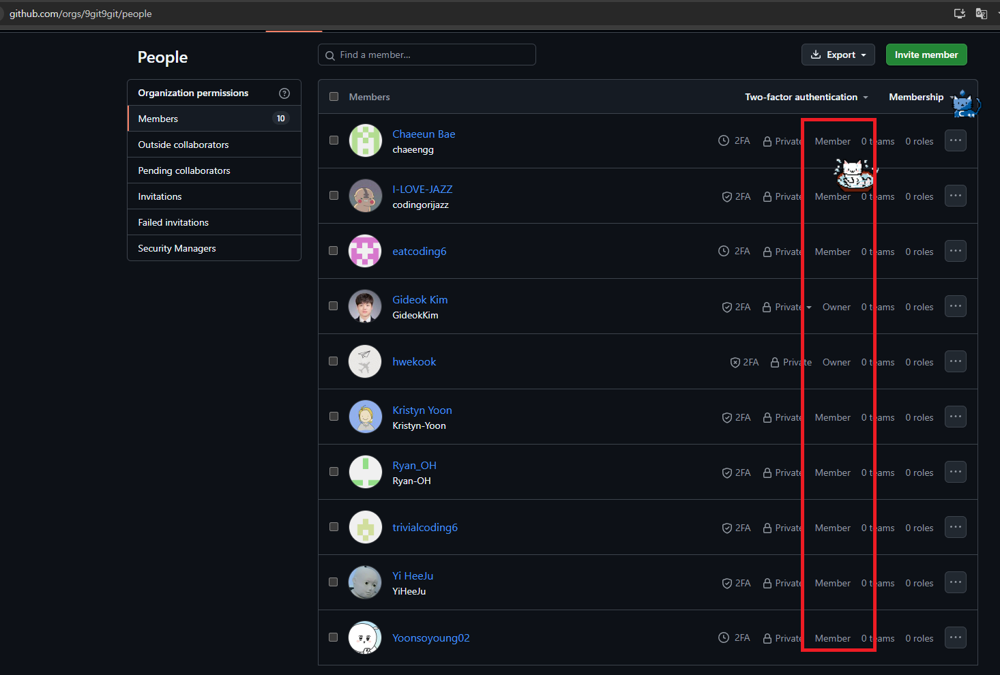
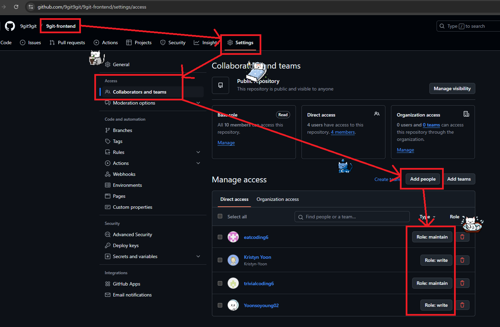

# GitHub Initial Settings

> 협업 프로젝트에서 사용하는 GitHub 초기 설정 방법을 정리한 문서입니다.

# Checklists

- [ ] 조직(Organization) 만들기
- [ ] 조직 멤버 초대
- [ ] 조직 멤버 권한 설정
- [ ] 저장소별 권한 설정

# 조직(Organization) 만들기

- GitHub에서 협업을 하기 위해 조직을 만들 수 있습니다.
- 조직은 여러 명의 사용자가 협업을 할 때 사용하는 단위입니다.
- 조직 내부에 여러 저장소를 만들어 함께 관리할 수 있습니다.

{: .align-center}

- 주변 사람들과 프로젝트를 진행하는 경우 Free plan으로 조직을 만들어 협업을 진행할 수 있습니다.
  - `Create a free organization` 버튼을 클릭하면 조직을 만들 수 있습니다.
  - 조직 이름, 연락처, 조직의 소속 등을 기입하면 조직이 만들어집니다.
  - 선택 사항으로 `GitHub Copilot` 사용 여부를 선택할 수 있습니다.

{: .align-center}

# 조직 멤버 초대

- 내가 만든 조직에서 협업을 진행하기 위해 주변 사람들을 초대할 수 있습니다.
  - GitHub Profile 기반으로 검색할 수 있고, 이메일 주소로도 검색하여 초대할 수 있습니다.

{: .align-center}

# 조직 멤버 권한 설정

- 초대된 멤버는 초대 메일을 통해 조직에 참여할 수 있습니다.
- 조직 생성자의 경우 초대된 멤버들에게 조직 내의 권한을 부여할 수 있습니다.

## 권한 수준 설명

- `Owner`
- **권한**: 조직의 모든 설정을 관리할 수 있는 권한을 가집니다. 여기에는 팀 생성, 권한 부여, 리포지토리 관리, 청구 정보 수정 등이 포함됩니다.
- **책임**: 조직의 전반적인 관리와 운영을 책임집니다. 새로운 멤버를 초대하거나 기존 멤버의 권한을 변경할 수 있습니다.
- `Member`
- **권한**: 기본적으로 조직 내에서 리포지토리에 접근하고 기여할 수 있는 권한을 가집니다. 그러나 조직의 설정이나 관리에 대한 권한은 없습니다.
- **책임**: 주로 코드 작성, 리뷰, 이슈 관리 등 프로젝트에 기여하는 역할을 수행합니다.

{: .align-center}

# 저장소별 권한 설정

- 조직 내에 여러 저장소를 만들어 함께 관리할 수 있습니다.
- 저장소별 권한 설정은 조직 내에서 저장소를 만든 뒤에 설정할 수 있습니다.

## 권한 수준 설명

- `Read`: 사용자는 저장소의 내용을 읽을 수 있습니다. 코드, 이슈, 풀 리퀘스트 등을 볼 수 있지만, 수정이나 삭제는 할 수 없습니다.
- `Triage`: 사용자는 이슈와 풀 리퀘스트를 관리할 수 있습니다. 이에는 라벨 추가, 이슈 할당, 이슈 닫기 등이 포함됩니다. 코드 수정은 할 수 없습니다.
- `Write`: 사용자는 저장소에 대한 쓰기 권한을 가집니다. 코드 수정, 커밋, 브랜치 생성 및 삭제가 가능합니다. 그러나 설정 변경이나 권한 관리에는 접근할 수 없습니다.
- `Maintain`: 사용자는 저장소의 유지 관리 작업을 수행할 수 있습니다. 이에는 브랜치 보호 규칙 설정, 이슈 및 풀 리퀘스트 관리, 태그 추가 등이 포함됩니다. 그러나 사용자 관리나 삭제 권한은 없습니다.
- `Admin`: 사용자는 저장소의 모든 권한을 가집니다. 설정 변경, 사용자 관리, 권한 부여 및 삭제가 가능합니다.

{: .align-center}
