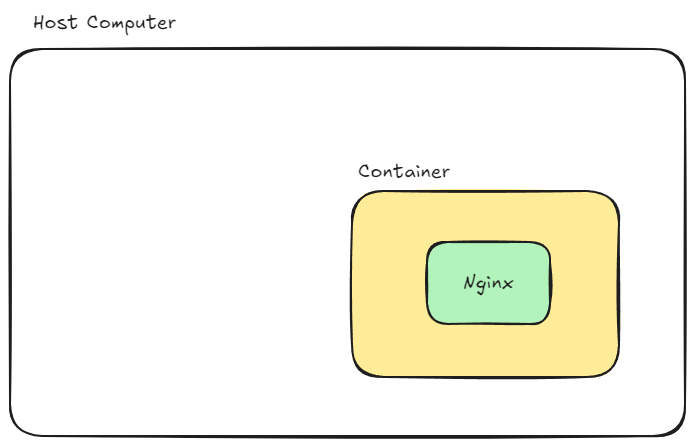

# Dockcer 정리

## 1. Dockcer 기본 개념

### 1.1. Dockcer를 왜 사용할까?

> 현업에서 Dockcer를 사용하는 이유는 바로 **이식성** 때문이다.

- 이식성: 특정 프로그램을 다른 곳으로 쉽게 옮겨서 설치 및 실행할 수 있는 특성
- 그 외 여러가지 장점이 있다.
  - 매번 귀찮은 <u>설치 과정을 하지 않아도 된다.</u>
  - <u>항상 일관</u>되게 환경을 구축할 수 있다.
  - 프로그램이 독립적으로 실행되기 때문에 <u>서로 간섭을 주지 않는다.</u>

### 1.2. Dockcer, image, container

- `Dockcer`: 컨테이너를 사용하여 각각의 프로그램을 분리된 환경에서 실행 및 관리할 수 있는 도구이다.
- `container`: 하나의 컴퓨터 환경 내에서 독립적인 컴퓨터 환경을 구성해서 각 환경에 프로그램을 별도로 설치할 수 있게 만든 개념. 즉, 하나의 컴퓨터 안에 여러 미니 컴퓨터가 있는데, 이 미니 컴퓨터를 컨테이너라고 한다.
  - `컨테이너의 독립성`: 컨테이너는 각자의 디스크(저장 공간)와 네트워크(IP, Port)를 가지고 있어 컨테이너끼리 파일을 접근할 수 없고 서로 다른 네트워크를 가진다.
- `image`: 프로그램을 실행하기 위한 파일 시스템 및 설정 등을 포함한 파일이다. 닌텐도의 게임 칩이 이와 유사하다.
- `Host Computer`: 컨테이너를 실행하는 컴퓨터. 쉽게 말해 내 컴퓨터에서 실행하고 있다면 내 컴퓨터가 호스트 컴퓨터이다.


### 1.3. Dockcer 설치

#### 1.3.1. Windows

- WSL2가 설치되어 있어야 한다.
  - [설치 방법 참고 링크](https://gideokkim.github.io/environment%20setup/wsl-install/)
- Dockcer Desktop 설치
  - [설치 방법 참고 링크](https://myanjini.tistory.com/entry/%EC%9C%88%EB%8F%84%EC%9A%B0%EC%97%90-%EB%8F%84%EC%BB%A4-%EB%8D%B0%EC%8A%A4%ED%81%AC%ED%83%91-%EC%84%A4%EC%B9%98)
- 가상화 문제 해결
  - [가상화 문제 해결 방법 참고 링크](https://ohorange.tistory.com/56)

#### 1.3.2. Mac

- Dockcer Desktop 설치
  - [설치 방법 참고 링크](https://happylie.tistory.com/78)

### 1.4. 따라하면서 Dockcer 전체 흐름 살펴보기

> Nginx 컨테이너를 생성하고 실행하는 전체 흐름을 살펴보자.

- Nginx: 웹 서버 렌더링 프로그램이라고 생각하고 넘어가자.
- **⚠️주의사항⚠️**
  - 설치한 `Docker Desktop`을 실행하자.
  - Windows는 `PowerShell`을 사용하자.

1. Nginx 이미지 다운로드

```bash
docker pull nginx
```

2. 이미지 목록 확인

```bash
docker images ls
```

3. 이미지를 컨테이너에 올려 Nginx 서버 실행
    - `-d` 옵션을 붙이면 컨테이너가 백그라운드에서 실행된다.
    - `--name` 옵션을 붙이면 컨테이너의 이름을 지정할 수 있다.
    - `-p` 옵션을 붙이면 호스트 컴퓨터의 포트와 컨테이너의 포트를 연결해준다.

```bash
docker run -d --name nginx-server -p 80:80 nginx
```

4. Nginx 서버가 잘 실행되는지 확인하기.
    - 브라우저에서 `localhost:80`으로 접속해서 확인해보자.


5. 실행되고 있는 모든 컨테이너 상태 확인하기
    - 컨테이너 ID, 이름, 이미지, 상태, 포트 등 상세 정보를 확인할 수 있다.

```bash
docker ps -a
```

6. 특정 컨테이너 중지
    - 컨테이너 이름을 이용해 정지할 수도 있고 컨테이너 ID를 이용해 정지할 수도 있다.

```bash
docker stop nginx-server
```

> 그림으로 보는 실습 상황



## 2. Dockerfile로 이미지 만들기

### 2.1. Dockerfile이란?

> 이미지를 만들기 위한 명령어를 모아둔 파일이다.

- 다른 사람들이 만들어준 이미지는 [Docker Hub](https://hub.docker.com/)에 있다.
  - 앞서 사용한 Nginx 이미지는 [Docker Hub - Nginx](https://hub.docker.com/_/nginx)에서 다운로드 받았다.
- 남들이 만들어둔 이미지를 쓸 수 있겠지만 내가 만들려는 서비스에 맞게 이미지를 커스터마이징해야 할 때 `Dockerfile`을 사용한다.

### 2.2. `FROM`: 베이스 이미지 생성

> 이미지를 만들기 위한 베이스 이미지를 지정한다.

- 태그명을 적지 않으면 항상 이미지의 최신 버전을 사용한다.

```bash
# FROM [이미지명]
# FROM [이미지명]:[태그명]
FROM ubuntu:20.04
```

### 2.3. `ENTRYPOINT`: 컨테이너 실행 시 실행될 명령어 지정

> 컨테이너 실행 시 실행될 명령어를 지정한다.

```bash
ENTRYPOINT ["python", "app.py"]
```

- (디버깅을 해야 할 경우) 컨테이너 종료를 지연시키고 싶을 때도 사용한다.

```bash
ENTRYPOINT ["/bin/bash", "-c", "sleep 500"]
```

### 2.4. `RUN`: 이미지 생성 과정에서 필요한 명령어 실행

> 이미지 생성 과정에서 필요한 명령어를 실행시킬 때 사용한다.

- 이미지가 컨테이너에 사용되기 전에 이미지 내부에서 명령어를 실행한다.

```bash
RUN pip install numpy
```

### 2.5. `COPY`: 파일 복사

> 파일을 이미지에 복사한다.

```bash
# COPY [호스트 컴퓨터에 있는 복사할 파일의 경로] [컨테이너에서 파일이 위치할 경로]
COPY . /app
COPY ./requirements.txt /app/requirements.txt
```

### 2.6. `WORKDIR`: 작업 디렉토리 지정

> 컨테이너 내부에서 작업 디렉토리를 지정한다.

- 컨테이너 내부의 폴더를 깔끔하게 관리하기 위해서 사용한다.

```bash
# WORKDIR [작업 디렉토리로 사용할 절대 경로]
WORKDIR /app
```

### 2.7. `EXPOSE`: 포트 노출

> 컨테이너 내부에서 사용되는 포트를 노출한다.

- 단순 문서화 기능이므로 실제 포트 매핑이 되는건 아니다.

```bash
# EXPOSE [포트번호]
EXPOSE 8000
```

## 3. Docker Compose를 활용해 컨테이너 관리하기

> 아마도 프론트엔드 Dockerfile이 있고 백엔드도 Dockerfile을 각각의 저장소에 만들텐데, 이를 DevOps 저장소에서 Docker Compose로 관리하는 형태가 될 것 같다.

### 3.1. Docker Compose란?

> 여러 개의 컨테이너를 **하나의 서비스로 정의**하고 관리할 수 있도록 도와주는 도구이다.

- 사용 이유?
  - 여러 개의 컨테이너를 관리하는데 용이하다.
  - 복잡한 명령어로 컨테이너를 실행시키던 것을 간소화시킬 수 있다.

### 3.2. Docker Compose로 하나의 컨테이너 실행

> 이전에 실행했던 Nginx 컨테이너를 Docker Compose로 실행해보자.

- 아래는 이전에 실행하던 명령어이다.
  - DB 컨테이너를 다룰 때는 명령어가 훨씬 더 길어진다.

```bash
docker run -d --name nginx-server -p 80:80 nginx
```

- `compose.yml` 파일 작성하기

```bash
# 파일명은 반드시 `compose.yml` 이어야 한다.
services:
  nginx-server:
    container_name: nginx-server
    image: nginx
    ports:
      - 80:80
```

- 아래는 Docker Compose로 실행하는 명령어이다.

```bash
docker compose up -d
```

- Docker Compose 실행 현황 확인해보기

```bash
docker compose ps
```

- Docker Compose로 실행한 컨테이너는 아래 명령어로 중지 및 삭제를 할 수 있다.

```bash
docker compose down
```

### 3.3. Docker Compose로 여러 개의 컨테이너 실행

> MySQL, Redis 컨테이너를 실행해보자.

- `compose.yml` 파일 작성하기

```bash
# 파일명은 반드시 `compose.yml` 이어야 한다.
services:
  my-db:
    image: mysql
    environment:
      MYSQL_ROOT_PASSWORD: pwd1234
    volumes:
      - ./mysql_data:/var/lib/mysql
    ports:
      - 3306:3306

  my-cache-server:
    image: redis
    ports:
      - 6379:6379
```

### 3.4 Docker CLI와 Docker Compose 변환

#### 3.4.1. Docker CLI를 Docker Compose로 변환

- [링크](https://www.composerize.com/)

#### 3.4.2. Docker Compose를 Docker CLI로 변환

- [링크](https://www.decomposerize.com/)